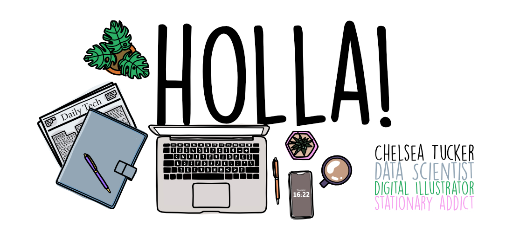

Hi, I'm Chelsea. A lover of all things technical, I spend my day as a Data Scientist building machine learning models. By evening I champion and promote women in STEM subjects through speaking at events and creating content on Instagram, YouTube and TikTok. I aim to ignite a belief in young people that they have what it takes to thrive in a world of numbers and computing; regardless of gender or race. I also acknowledge that not everyone is dealt the same privileges in life and so I create free visually appealing mathematical learning materials using my background in both fine art and mathematics. And I do all of this drinking copious amounts of Yorkshire tea, buying aesthetically pleasing stationary and planning holidays that revolve around longboarding, kitesurfing and general “vanlife” antics.
